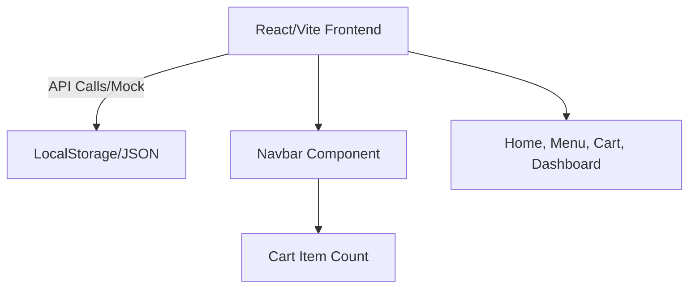

# Milestone 1: Planning & Setup

## 1. Problem Statement & Motivation
**Domain:** Online Food Ordering System
**Problem:** Local restaurants struggle to manage orders efficiently because they rely on phone calls, leading to errors, missed orders, and slow service. Customers want a seamless way to browse menus, add items to a cart, and place orders online.
**Motivation:** Build a responsive, beautiful web application to streamline the ordering process and improve the customer experience.

## 2. Target Users & Stakeholders
- **Customers**: Browse the menu, add items to the cart, and checkout.
- **Restaurant Owners/Admins**: View placed orders and manage the menu (mock feature).
- **Store Managers**: Handle inventory and track stock (mock feature).

## 3. Scope (In / Out)
**In-Scope:**
- Beautiful, responsive UI (Vanilla CSS layout with glassmorphism).
- Product Catalog (Menu page with mock data).
- Shopping Cart functionality (using LocalStorage).
- Checkout Order Flow (mock placement).
- Role-based mock Dashboard for Admins.

**Out-of-Scope:**
- Real payment gateway integration (e.g., Stripe).
- Real-time backend database (Firestore / MongoDB).
- Live email notifications.

## 4. Architecture Diagram (Text Representation)

## 5. Gantt Chart & Roles
| Task | Owner | W1 | W2 | W3 | W4 | W5 |
|---|---|---|---|---|---|---|
| M1: Project Planning & Setup | Team Leader (TL) | ██ |    |    |    |    |
| M2: UI/UX & Base Components | Dev 1          |    | ██ |    |    |    |
| M3: Core Features (Cart, Dashboard) | Dev 2    |    |    | ██ | ██ |    |
| M4: Polish, Testing & Deployment | All Members |    |    |    |    | ██ |

## 6. Risks & Mitigation
- **Risk 1:** UI looks generic. **Mitigation:** Use custom Vanilla CSS design system with vibrant gradients and micro-animations instead of relying on basic templates.
- **Risk 2:** State management complexity for Cart. **Mitigation:** Use simple React Context or uplifting state combined with LocalStorage.
- **Risk 3:** Git merge conflicts. **Mitigation:** Clear division of features per branch (`Dev1/ui`, `Dev2/features`).
